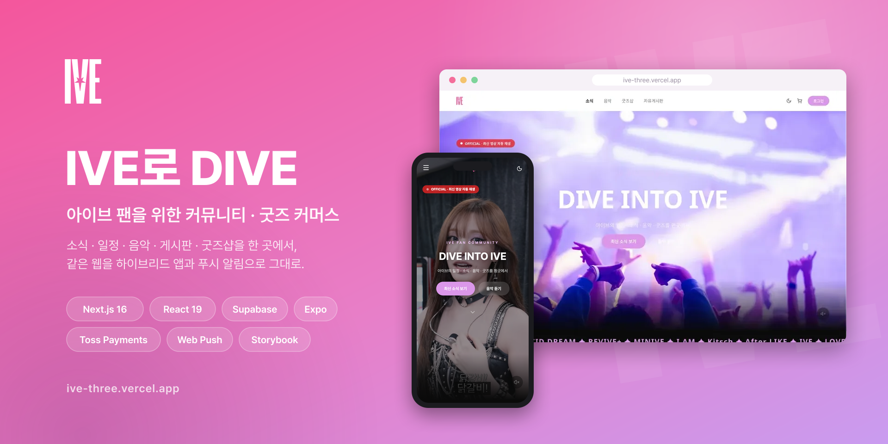
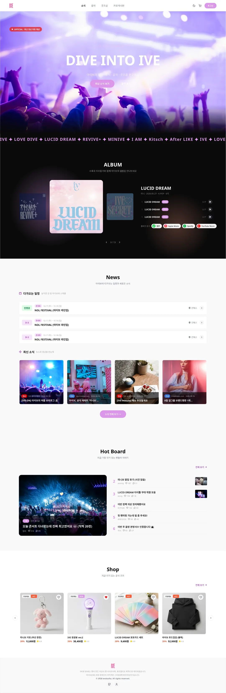
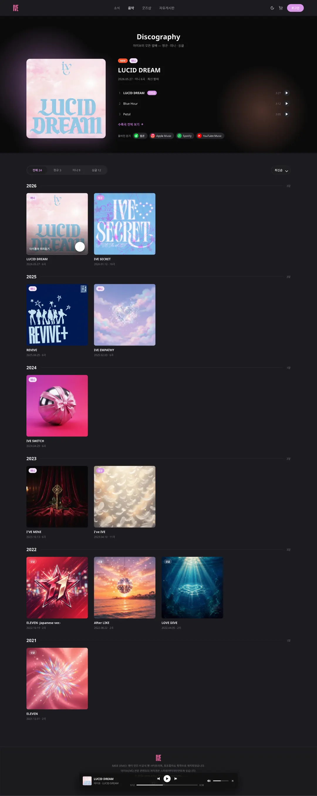
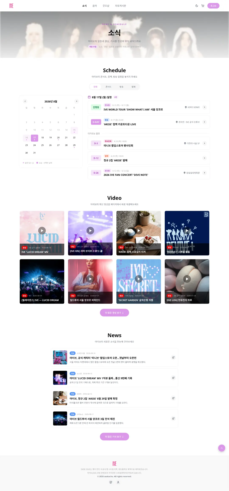
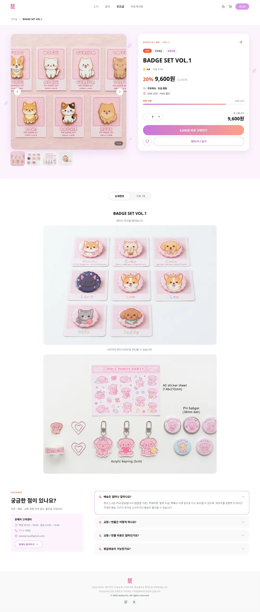
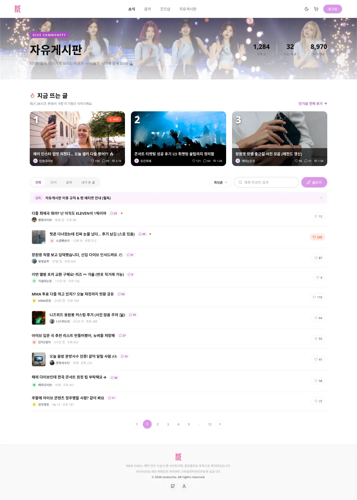
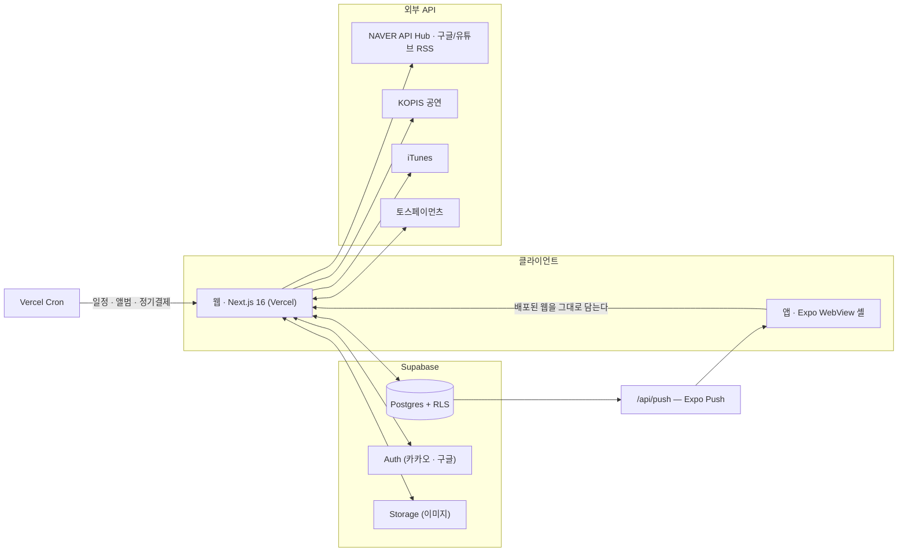

# IVE로 DIVE

**아이브(IVE) 팬을 위한 커뮤니티 + 굿즈 커머스 서비스.**

소식·일정·음악·굿즈·게시판을 한 곳에서 보고, 같은 웹을 하이브리드 앱에서 그대로 쓴다.


[](https://github.com/seokachu/ive-app/releases/latest/download/ive-dive.apk)

**바로 보기** — [서비스](https://ive-three.vercel.app) · [기능명세서](https://ive-three.vercel.app/docs) · [디자인 시안](https://ive-three.vercel.app/docs/design.html) · [스토리북](https://ive-storybook.vercel.app) · [앱 다운로드](#앱-다운로드) · [하이브리드 앱 레포](https://github.com/seokachu/ive-app)

`1차 배포` 2024.10.18 ~ 2025.01.26 — 메인·로그인·회원가입·굿즈샵·장바구니·마이페이지·결제<br/>
`2차 배포` 2025.01.26 ~ 2025.02.02 — 버그 수정<br/>
`3차 배포` 2025.02.02 ~ 2025.03.06 — 자유게시판<br/>
`4차 배포` 2025.03.06 ~ 2025.03.16 — 소식 페이지<br/>
`리뉴얼` 2026.07 ~ — Next.js 16 · React 19 마이그레이션, 하이브리드 앱·푸시 알림, 전면 리디자인, DIVE 멤버십(토스 빌링 월 구독 — 등급 뱃지·굿즈 할인)

---

## 화면

<p>
  
  
  
  
  
</p>

전체 시안은 [디자인 시안 (웹)](https://ive-three.vercel.app/docs/design.html)에서 —
화면 57장을 라이트/다크로 배포된 서비스 안에서 그대로 열람할 수 있다.
리뉴얼 전 화면은 [아래 아카이브](#리뉴얼-전-화면-v1-아카이브)에 남겨 두었다.

---

## 앱 다운로드


Android 폰 카메라로 QR을 찍거나, 아래 링크로 받는다.

**[⬇ ive-dive.apk 다운로드](https://github.com/seokachu/ive-app/releases/latest/download/ive-dive.apk)**

- 배포된 웹을 그대로 담는 하이브리드 앱이라, 웹이 갱신되면 앱도 재설치 없이 함께 갱신된다
- 설치 시 "출처를 알 수 없는 앱" 허용이 필요하다 (스토어 외 배포)
- 앱에서만 되는 것 — 댓글·답글·좋아요 **네이티브 푸시 알림**, 브랜드 스플래시, 뒤로가기 2회 종료

<br clear="right" />

---

## 주요 기능

**메인 · 음악**
- 영상 히어로(썸네일 폴백)·마퀴 스트립·앨범 커버 3장 — 스크롤 위치에 따라 헤더 톤이 바뀐다
- iTunes 30초 미리듣기 — **페이지를 옮겨도 재생이 끊기지 않는다.** 루트 레이아웃에 전역
  마운트한 플레이어가 이동 시 우하단 미니 디스크로 접힌다
- `/discography` — 최신 발매반 히어로, 연도 그룹핑, 커버에 마우스를 올리면 타이틀곡이 재생된다

**소식 · 일정 (자동 수집)**
- 수동 입력을 없앴다. NAVER API Hub(뉴스·이미지) + 구글 뉴스 RSS + 유튜브 공식 재생목록
  RSS를 합쳐 피드를 만든다 — 크롤링 대신 공개 API만 쓴다
- 일정은 KOPIS 공연 API와 **뉴스 본문에서 추출한 일정**을 합쳐 캘린더에 뿌린다
- 카테고리 필터, 다가오는/지난 일정, 기사 원문은 새 탭으로

**굿즈샵 · 장바구니 · 결제**
- 굿즈 70종 — 수집·이미지 최적화(WebP) 스크립트로 데이터 파이프라인을 만들어 넣었다
- 비회원도 찜할 수 있고(로컬스토리지), 로그인하면 서버 찜과 합쳐진다
- 리뷰 별점·페이지네이션, FAQ 아코디언, 공유 시트
- 토스페이먼츠 결제창 → 서버 승인(`/api/payment/confirm`) → 주문 완료까지 한 흐름

**자유게시판**
- 에디터는 **Tiptap** — 툴바·이미지 업로드(Supabase Storage)를 직접 구성했다
- HOT 3 카드, 필터 필(전체/인기/공지/내 글), 정렬 드롭다운, 검색어 하이라이트
- 댓글·대댓글·좋아요, 수정/삭제, 작성자 뱃지 — 댓글과 좋아요는 그 순간 **푸시로 나간다**

**마이페이지 · 멤버십 (구독)**
- 위시리스트 · 주문 내역 · 내가 쓴 글 · 배송지 관리, 아바타 크롭 편집, 회원탈퇴(글·댓글은 "탈퇴한 회원"으로 보존)
- **DIVE 멤버십** — 3단 플랜(무료 / DIVE+ 월 1,900원 / VIP 월 5,900원), 토스 **빌링키**로
  첫 결제 후 매월 크론이 자동 결제한다 (결제 실패 시 해지 처리)
- 구독 관리가 전부 마이페이지에서 끝난다 — 카드 변경, 플랜 변경(업그레이드는 남은 기간
  **차액만 즉시 결제**, 다운그레이드는 다음 결제일 예약), 해지·해지 취소(혜택 종료일까지 유지)
- 혜택은 서비스 전체에 실적용 — 닉네임 옆 **티어 뱃지**(DIVE+ 보라 / VIP 골드)와 아바타 링이
  게시판·댓글·리뷰에 표시되고, 굿즈 결제에 상시 할인(5%/10%)이 자동 반영된다

**공통**
- 라이트/다크 단일 토큰 세트 — 색은 전부 CSS 변수로 정의하고 다크에서 값만 뒤집는다
- 공통 UI는 [스토리북](https://ive-storybook.vercel.app)으로 문서화했다
- Playwright E2E 10개 스펙(프로덕션 빌드 기준)으로 주요 흐름을 지킨다

---

## 구조



**자동화 (Vercel Cron)**

| 시각 (KST) | 경로 | 하는 일 |
|---|---|---|
| 06:00 | `/api/cron/schedule-extract` | 수집한 뉴스에서 일정을 뽑아 `schedules`에 반영 |
| 06:30 | `/api/cron/album-sync` | iTunes 신규 발매반(4곡 이상)을 자동 등록 |
| 07:00 | `/api/cron/membership-billing` | 멤버십 정기결제 실행 |

---

## 2026 리뉴얼

운영 중이던 서비스를 최신 스택으로 단계적으로 옮기고, 앱과 디자인 시스템까지 확장했다.

- **Next.js 14 → 16, React 18 → 19** — 동적 라우트 async params, `middleware` → `proxy` 전환 포함
- **Recoil → Zustand** — 상태별 스토어 분리(session/cart/checkout/ui/player), 점진적 전환
- **Supabase 인증 현대화** — deprecated auth-helpers → `@supabase/ssr`(쿠키 기반 서버 검증)
- **npm → pnpm**, **Playwright E2E 기준선** 구축
- **하이브리드 앱 + 푸시 알림** — [seokachu/ive-app](https://github.com/seokachu/ive-app),
  댓글/답글 푸시 발송 서버 구현 ([설계 문서](public/docs/push-notifications.md))
- **전면 리디자인** — `.pen` 시안 57장을 기준으로 메인부터 마이페이지까지 다시 그렸고,
  확정된 토큰·컴포넌트를 스토리북으로 공개했다
- **에디터 교체** — react-quill → Tiptap (구 게시글 렌더링용 CSS만 남겨 하위 호환 유지)

---

## 스토리북 (디자인 시스템)

[**ive-storybook.vercel.app**](https://ive-storybook.vercel.app) — 색상·타이포그래피·간격 토큰과
`src/components/ui`·`src/components/common`의 공통 컴포넌트를 앱과 같은 코드로 렌더링한다.
툴바의 테마 토글은 앱과 같은 방식(`html.dark`)으로 다크 모드를 확인한다.

```bash
pnpm storybook          # 로컬 개발 서버 (http://localhost:6006)
pnpm build-storybook    # 정적 빌드 → storybook-static/
pnpm storybook:deploy   # 빌드 후 Vercel(ive-storybook 프로젝트) 프로덕션 배포
```

- 설정: `.storybook/main.ts`(`@storybook/nextjs-vite`), `.storybook/preview.tsx`(globals.css·Pretendard·테마 데코레이터)
- 스토리는 컴포넌트 옆에 `*.stories.tsx`로 두고, Foundations 문서만 `src/stories/`에 모은다
- 규칙 원문은 [`public/docs/design-system.md`](public/docs/design-system.md)

---

## 문서

| 문서 | 내용 |
|---|---|
| [기능명세서 v2 (웹)](https://ive-three.vercel.app/docs/spec-v2.html) | 리뉴얼 기준 기능 명세 |
| [기능명세서 v1 (웹)](https://ive-three.vercel.app/docs/spec-v1.html) | 리뉴얼 전 명세 · 아카이브 |
| [디자인 시안 (웹)](https://ive-three.vercel.app/docs/design.html) | `.pen` 화면 시안 57장 (라이트/다크) |
| [디자인 시스템 (웹)](https://ive-three.vercel.app/docs/design-system.html) | 색상·타이포·간격·컴포넌트 규칙 |
| [스토리북](https://ive-storybook.vercel.app) | UI 컴포넌트 카탈로그 |
| [푸시 알림 설계](public/docs/push-notifications.md) | 토큰 동기화 · 발송 서버 구조 |
| [Next 16 업그레이드 노트](public/docs/next16-upgrade-notes.md) | 마이그레이션 중 겪은 이슈 |
| [Zustand 마이그레이션](public/docs/zustand-migration-plan.md) | Recoil 제거 계획과 결과 |

---

## 기술 스택

| 구분 | 사용 |
|---|---|
| Framework | Next.js 16 (App Router) · React 19 |
| Language | TypeScript |
| Styling | Tailwind CSS 3 · shadcn/ui · Pretendard |
| State / Data | Zustand · TanStack Query · React Hook Form + Zod |
| Backend | Supabase (Postgres · Auth · Storage) |
| Payments | 토스페이먼츠 (결제 · 빌링키 정기결제) |
| Editor | Tiptap |
| App · Push | Expo WebView 셸 · Expo Push |
| Test | Playwright |
| Docs | Storybook · Pencil(`.pen`) |
| 그 외 | Swiper · react-avatar-editor · react-daum-postcode · lodash · DOMPurify |

---

## 시작하기

```bash
pnpm install
pnpm dev            # http://localhost:3000
```

`.env.local`에 아래 키가 필요하다.

| 키 | 용도 |
|---|---|
| `NEXT_PUBLIC_SUPABASE_URL` · `NEXT_PUBLIC_SUPABASE_ANON_KEY` | Supabase 클라이언트 |
| `SUPABASE_SERVICE_ROLE_KEY` | 크론·서버 라우트 전용 |
| `NEXT_PUBLIC_KAKAO_JS_KEY` | 카카오 공유 |
| `NEXT_PUBLIC_TOSS_CLIENT_KEY` · `TOSS_SECRET_KEY` · `PAYMENT_CONFIRM_URL` | 결제·정기결제 |
| `NAVER_CLIENT_ID` · `NAVER_CLIENT_SECRET` · `KOPIS_API_KEY` | 소식·일정 수집 |
| `NEXT_PUBLIC_RANDOM_NICKNAME_URL` | 랜덤 닉네임 |
| `CRON_SECRET` | 크론 엔드포인트 보호 (프로덕션) |
| `NEXT_PUBLIC_VAPID_PUBLIC_KEY` · `VAPID_PRIVATE_KEY` · `VAPID_SUBJECT` | 웹 푸시(PWA) — `npx web-push generate-vapid-keys`로 생성 |

```bash
pnpm lint            # ESLint
pnpm test:e2e        # Playwright (프로덕션 빌드 기준)
pnpm storybook       # 컴포넌트 카탈로그

pnpm goods:crawl     # 굿즈 데이터 수집
pnpm goods:optimize  # 굿즈 이미지 WebP 최적화
```

---

## 리뉴얼 전 화면 (v1 아카이브)

아래는 **2026 리디자인 이전**(v1) 화면과 기능이다. 현재 화면은 [디자인 시안](https://ive-three.vercel.app/docs/design.html)을 참고.

<details>
<summary>메인페이지</summary>
  <br>
  <table>
     <tr>
      <th align="center">PC</th>
      <th align="center">Mobile</th>
    </tr>
    <tr>
      <td valign="top" width="50%;">
        
      </td>
      <td valign="top">
        
      </td>
    </tr>
  </table>
  <ul>
    <li>스크롤 시 특정 섹션(ALBUM)부터 헤더 배경 색상 변경 (쓰로틀링 적용으로 성능 최적화)</li>
    <li>앨범 섹션 - Swiper 라이브러리로 가로 스크롤 구현</li>
    <li>자유게시판 최신 글 미리보기 제공</li>
    <li>굿즈샵 인기 상품 미리보기 제공</li>
    <li>모바일에서 햄버거 메뉴 클릭 시 사이드바 형태로 변경</li>
  </ul>
</details>

<details>
<summary>로그인,회원가입 페이지</summary>
  <br>
   <table>
   <tr>
     <th align="center">로그인 페이지</th>
     <th align="center">회원가입 페이지</th>
   </tr> 
    <tr>
      <td valign="top" width="50%;">
         
         
      </td>
      <td>
         
      </td>
    </tr>
  </table>
  <ul>
    <li>로그인 팝업(모달 형태의 로그인 페이지 제공)</li>
    <li>기존 회원을 위한 일반 로그인 페이지</li>
    <li>회원가입 후 첫 로그인 시 폭죽 효과 및 축하 메시지 표시</li>
  </ul>
</details>

<details>
<summary>소식페이지</summary>
<br>
 <table>
    <tr>
      <td valign="top">
         
      </td>
    </tr>
  </table>
  <ul>
    <li>최신 뉴스 조회 및 카테고리별 필터링</li>
    <li>갤러리 사진 조회</li>
    <li>더 많은 콘텐츠 로드 (페이지네이션)</li>
    <li>모달을 통한 상세 내용 조회</li>
  </ul>
</details>

<details>
<summary>굿즈샵 페이지</summary>
  <br>
  <table>
   <tr>
     <th align="center">굿즈샵 - 메인</th>
     <th align="center">굿즈샵 - 디테일 페이지</th>
   </tr> 
    <tr>
     <td valign="top" width="50%">
       
     </td>  
     <td valign="top">
       
     </td>
    </tr>
  </table>
  <ul>
    <li>
      굿즈샵 페이지
      <ul>
        <li>카테고리별 정렬과 무한스크롤을 통해 콘텐츠를 자동으로 로딩</li>
        <li>비회원 찜하기 기능, 로그인 시 로컬스토리지에 저장된 찜과 연동</li>
      </ul>
    </li>
    <br>
    <li>
      굿즈샵 디테일 페이지
      <ul>
        <li>공유하기 버튼 (링크 복사 제공)</li>
        <li>상품 수량 선택 (최대 5개, 초과 시 토스트 알림)</li>
        <li>상세정보와 리뷰 탭 (상세정보 기본, 별점 평균과 5개씩 나누어 보여주는 페이지네이션)</li>
        <li>자주 묻는 질문(FAQ)은 아코디언 형식으로 표시</li>
      </ul>
    </li>
  </ul>
</details>

<details>
<summary>자유게시판 페이지</summary>
  <br>
   <table>
   <tr>
     <td align="center">자유게시판<br>- 메인</td>
     <td valign="top" width="80%">
       
       
     </td>
   </tr>
   <tr>
     <td align="center">자유게시판<br>- 글쓰기 페이지</td>
     <td valign="top" width="80%">
       
     </td>  
   </tr>
   <tr>
     <td align="center">자유게시판<br>- 디테일 페이지</td>
     <td valign="top" width="80%">
       
     </td>  
   </tr>
  </table>

  <ul>
    <li>
      자유게시판 - 메인페이지
      <ul>
        <li>게시판 데이터 불러오기 (리스트 10개씩 페이지네이션)</li>
        <li>검색어 입력 시 디바운싱과 하이라이트 표시 제공</li>
        <li>모바일 댓글버튼 클릭 시 댓글로 스크롤 할 수 있게 이동</li>
      </ul>
    </li>
    <br>
    <li>
      자유게시판 - 글쓰기 페이지
      <ul>
        <li>React-quill 라이브러리 사용 (현재는 Tiptap으로 교체됨)</li>
      </ul>
    </li>
    <br>
    <li>
      자유게시판 - 디테일 페이지
      <ul>
        <li>공유하기 버튼 (링크 복사 제공)</li>
        <li>좋아요, 댓글, 대댓글 제공</li>
        <li>게시글 수정/삭제, 댓글&대댓글 수정/삭제 제공</li>
      </ul>
    </li>
  </ul>
</details>

<details>
<summary>장바구니 페이지</summary>
  <br>
   <table>
     <tr>
       <td valign="top" width="80%">
         
            
       </td>  
     </tr>
  </table>
  <ul>
    <li>장바구니 데이터 불러오기 및 체크박스로 아이템 선택 가능</li>
    <li>선택삭제, 전체삭제 기능으로 장바구니 아이템 관리</li>
    <li>상품별 삭제 기능 및 전체삭제 클릭 시 확인 모달</li>
    <li>상품 금액 및 할인 금액 계산 표시</li>
    <li>장바구니가 비어있을 때 '쇼핑하기' 버튼을 통한 UX 개선</li>
    <li>주문자 정보, 배송지 정보 변경 제공</li>
    <li>개인정보 수집 및 이용 동의 모달 (상세 약관 내용 포함)</li>
    <li>결제 금액 실시간 계산 (총 결제 금액, 상품 금액, 할인 금액)</li>
    <li>결제하기 기능 제공</li>
  </ul>
</details>

<details>
<summary>마이 페이지</summary>
  <br>
   <table>
     <tr>
        <td align="center">마이페이지<br>- 아바타, 닉네임 수정</td>
        <td valign="top" width="80%">
         
       </td>  
     </tr>
     <tr>
        <td align="center">마이페이지<br>- 찜 목록 리스트</td>
        <td valign="top" width="80%">
         
       </td>  
     </tr>
     <tr>
        <td align="center">마이페이지<br>- 결제 목록</td>
        <td valign="top" width="80%">
         
        </td>  
     </tr>
     <tr>
        <td align="center">마이페이지<br>- 내가 쓴 글</td>
        <td valign="top" width="80%">
         
        </td>  
     </tr>
     <tr>
        <td align="center">마이페이지<br>- 배송지 관리</td>
        <td valign="top" width="80%">
         
         
        </td>  
     </tr>
  </table>
  <ul>
    <li>아바타 이미지 변경 - 프로필 이미지 편집 (react-avatar-editor 라이브러리)</li>
    <li>닉네임 변경 가능</li>
    <li>찜 목록, 결제 목록, 내가 쓴 글, 배송지 관리 데이터 불러오기</li>
    <li>결제목록 주문상세 페이지 - 구매확정 클릭 시 리뷰 작성 기능</li>
    <li>새 배송지 추가 버튼, 배송지 수정 및 삭제, 기본배송지 설정 기능 제공</li>
  </ul>
</details>

<details>
<summary>결제 페이지</summary>
   <br>
   <table>
     <tr>
        <td valign="top">
          
        </td>
     </tr>
  </table>
  <ul>
    <li>결제 완료 후 주문 성공 화면 및 결제 내역 요약 제공</li>
    <li>결제 성공 시 주문 번호와 결제 상세 정보 확인 가능</li>
  </ul>
</details>
